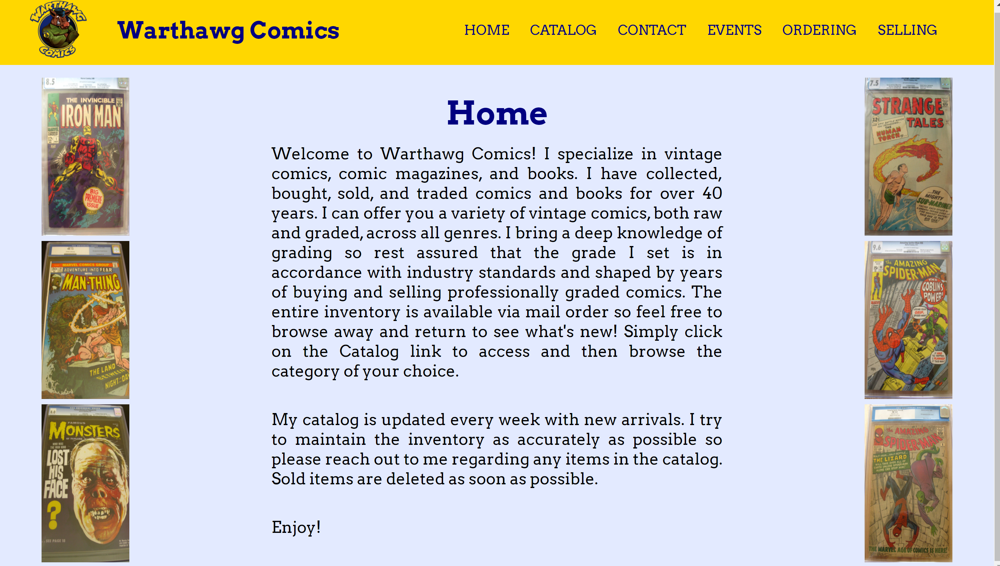
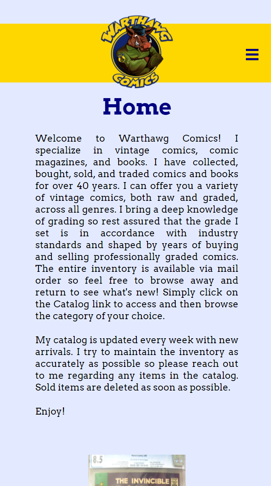
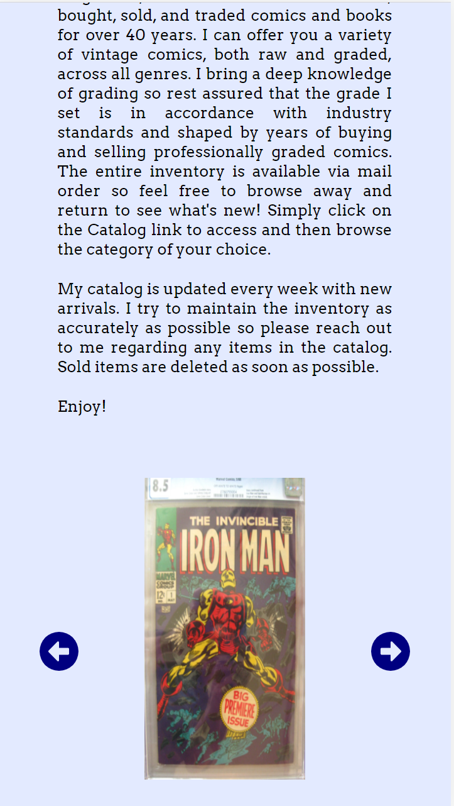

# Warthawg Comics - www.warthawgcomics.com

A website for a small business to buy/sell comics, and interact with their customers. Built on React.

## Design + Project Screenshot

This website was designed to adhere to be mobile-first design techniques, with emphasized ease on small mobile devices.  I used media queries, relative units in the specification of sizes, and other responsive web design tools in order to make the website as friendly to all devices as possible. Above, I have included two pictures displaying the mobile landing page and one displaying the dekstop landing.

## Reflection
The first version of this site consisted of static HTML + CSS pages and is now deprecated. I wanted to create a new version of the site that allowed for faster loading times, utilized new technologies, and kept more consistent formatting throughout the site. I considered using different frameworks for the rewritten version of this site, but ultimately settled on React.

Project goals included learning and familiarizing myself with React and JavaScript as well as the process of front-end web design.  The goals I was given from the business included straightforward navigation, ease in adding/removing comics from the catalog, and encouraging customer interaction.

My initial parameters from the business owner were efficency in keeping their catalog and Events pages updated with minimum knowledge of web development on their part. I chose to implement this by keeping the catalog files as easily edited as possible, so they grab data from JSON files. The business owner simply edits the data files and does not have to worry about any of the display or design.

This project was challenging for me because I was in the process of teaching myself React and JavaScript as I was building the site. The website underwent multiple versions as I became more proficient with these tools. 

## Progress
As mentioned above, this website is constantly being updated and changed according to the business owner's current catalog and comic events.  Future goals include more user interaction, such as a checkout cart. 

## Contributing
This website is currently a personal project, and is not looking for any other contributors beyond myself and the business owner.
